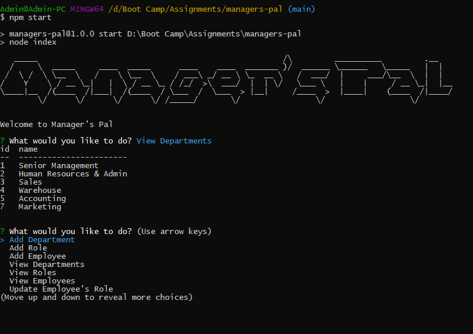

# Manager's Pal

## Contents

• [Description](#description)
• [Installation](#installation)
• [Usage](#usage)
• [Technologies](#technologies)
• [Links](#links)
• [Questions](#questions)
• [Contributing](#contributing)

## Description

This is a NodeJS Application to Help Managers Obtain Information and Run Queries and Make Changes to the Employee Database.

Features:  
• View Employees  
• View Departments  
• View Roles  
• Add Departments  
• Add Roles  
• Add Employees  
• Delete Departments  
• Delete Roles  
• Delete Employees  
• Update Employee's Role  
• Update Employee's Manager  
• View Budget by Department  
• View Employees by Manager

### Installation

To install the application you need to run the following command line:

```bash
npm i
```

### Usage

To run the application you need to run the following command line:

```
npm start
```

### Technologies

• JavaScript  
• NodeJS
• MySQL

## Links

### Link to a Video Tutorial

[Video Tutorial](pending)

### Link to the Github Repository

[Manager's Pal Github Repo](https://github.com/forester93/managers-pal/)

### Screenshot of the Application



## Questions

You can reach out to me over one of the following for any questions about this application.

| Name          | Email                    | Phone Numer       | GitHubProfile                                                  |
| ------------- | ------------------------ | ----------------- | -------------------------------------------------------------- |
| Mark Forester | markforester93@gmail.com | +61(0)404-831-362 | [Mark Forester Github Profile](https://github.com/forester93/) |

## Contributing

Contact me on the above.
